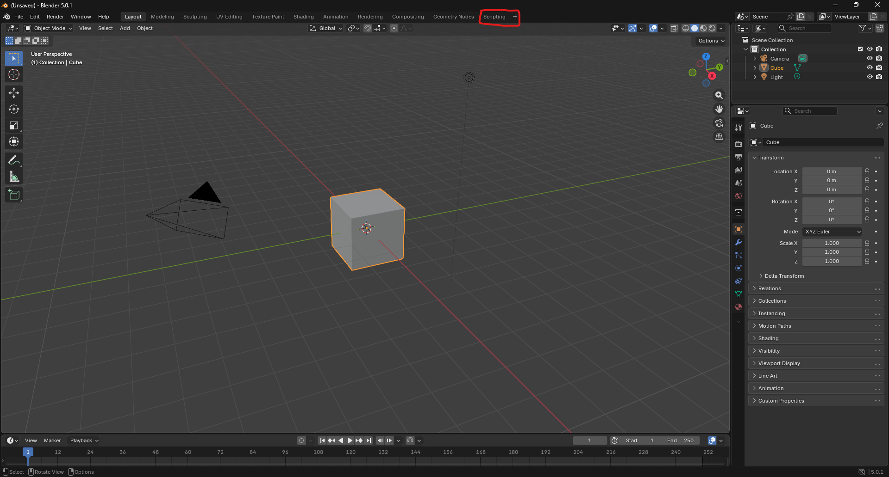
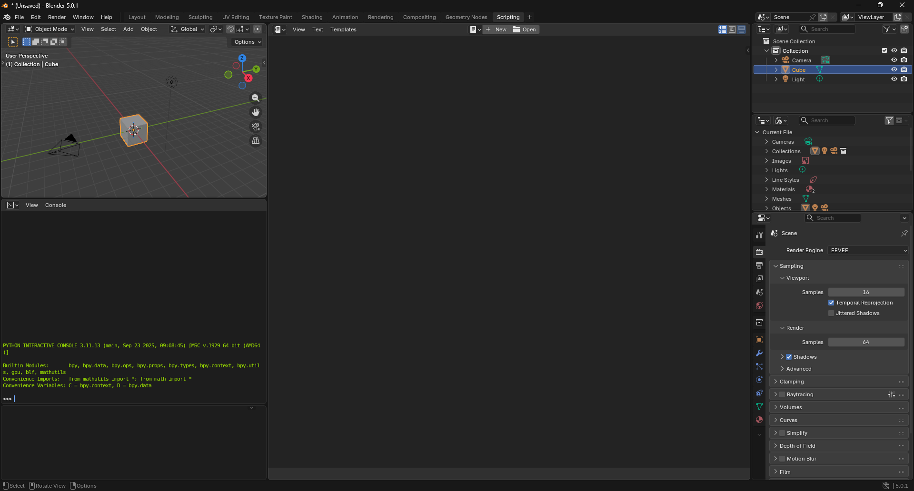
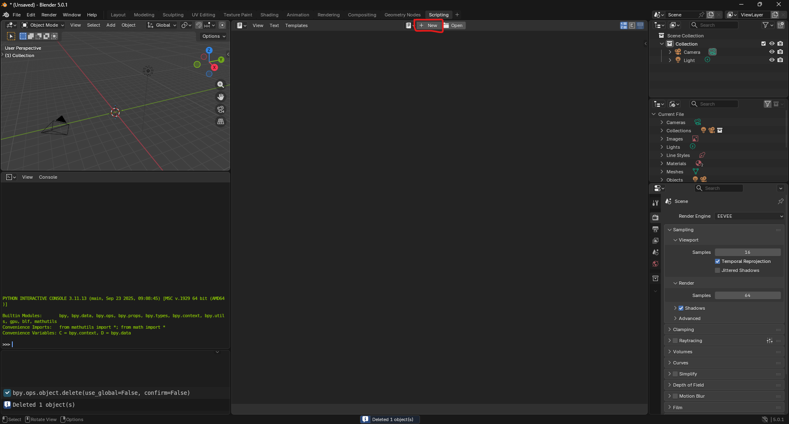
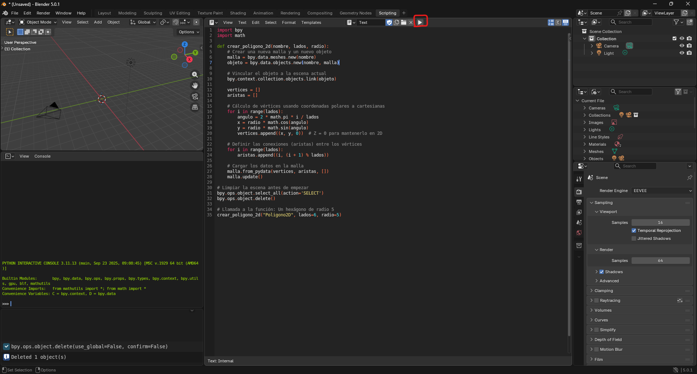

# Graficacion-practica-poligono
Practica en blender del dibujo de 1 poligono de n lados

## Requisitos para esta practica
1. Software "Blender"

## Bibliotecas utilizadas
1. bpy (Permite controlar blender a traves de codigo en python)
2. math (para usar las funciones trigonometricas y el numero pi)

## PASO 1
Abrir la aplicacion "Blender" e ir al apartado de "scripting"

Asi se ve el apartado de "Scripting"

- Nota: debemos de borrar el cuadrado primero para que podamos visualizar nuestro poligono, para ello daremos click en el cuadrado donde aparece la vista de previsualizacion y despues daremos la tecla "Del" o "Suprim" para borrarlo

## PASO 2
Daremos click en el apartado donde dice "+New" para empezar a escribir el codigo en esa parte.

## PASO 3
pegaremos el siguiente codigo para poder ejecutarlo 

## Resultados
Como resultados tenemos un poligono de 6 lados, el cual es un hexagono, el cual se logro gracias a la libreria de math, ya que esta nos permite utilizar algunas funciones matematicas

